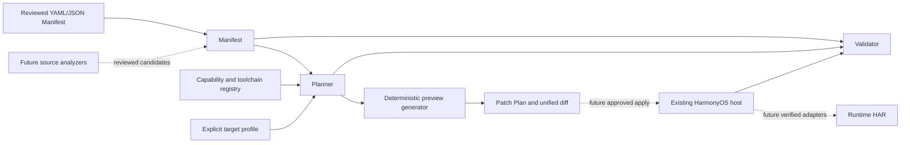

# HCB Architecture

HCB is a local-first enhancement toolchain. The existing HarmonyOS Stage project
at the repository root is an integration host, with its own Hvigor build. The
TypeScript CLI runs on the development machine and never imports ArkTS APIs.

## Package Boundaries

| Package | Responsibility | Dependencies |
| --- | --- | --- |
| `@hcb/manifest` | Strict schema, feature types, YAML/JSON loading, semantic checks | AJV, YAML |
| `@hcb/registry` | Explicit device/API evidence and target/toolchain validation | Manifest, YAML |
| `@hcb/planner` | Explainable recommend/conditional/reject decisions | Manifest, Registry |
| `@hcb/generator` | Deterministic HCB-owned artifact previews and unified diffs | Manifest, Planner |
| `@hcb/validator` | Manifest, target, host and generated ownership checks | Manifest, Registry, Planner, Generator |
| `@hcb/cli` | Commands, file IO orchestration, JSON output and exit codes | Public package APIs |

Dependencies flow in the direction shown. Analyzers and Runtime HAR are future
packages, introduced when their first working implementation exists. Runtime will
depend on platform contracts only, never on source analyzers or Node packages.

## First Working Slice

1. `init` creates an empty manifest and explicit target profile without inventing business features.
2. Developers describe and confirm existing features in the manifest.
3. `manifest validate` checks a discriminated schema and semantic invariants.
4. `plan` evaluates target constraints and feature eligibility, with reasons.
5. `apply --dry-run` previews plan/binding-contract documents under `.hcb/generated/`.
6. `validate` reports static readiness and the compile-check status separately.

All three platform capability entries start experimental. The source archive is
design input, not independent verification of a Huawei API. No ArkTS adapter,
permission, Ability, HAR dependency or host business change is generated in this
slice. Real `apply`, rollback and detach arrive with verified adapter generation.

## Contracts And Invariants

- Feature kinds are `ACTION`, `STATE`, and `RESOURCE`, each with a strict contract.
- Source OS/CPU metadata describes provenance only; target devices/API are explicit inputs.
- A plan has no timestamps or absolute paths, so identical inputs produce identical output.
- Registry evidence gates generation; semantic suitability alone never implies API support.
- Binary-only evidence requires human confirmation before positive planning.
- Preview paths are fixed HCB-owned paths; existing unowned/edited files are conflicts.
- File system writes belong to CLI initialization or a future explicit apply executor.
- Validation reports `compile_check: skipped` for this planning-only stage.
- HarmonyOS builds and real-device smoke tests are separate acceptance gates for adapters.

See `adr/0001-foundation.md` for the rationale and `IMPLEMENTATION_PLAN.md` for progress.
